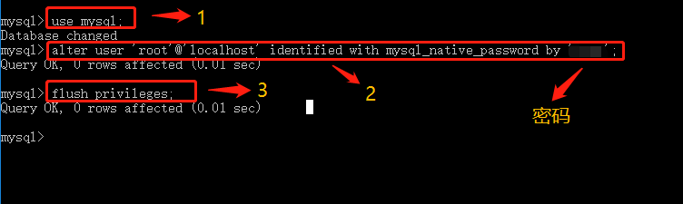

---
title: Navicat Mysql链接报错：client does not support anthentication protocol requester by server;consider upgrading mysql client
date: 2020-04-05 15:11:01
tags:
- MySQL
- Navicat MySQL
---
在本地安装好后MySQL，然后想用client连接本地的数据库，但是提示报错，在此记录下报错解决。

<!--more-->

操作：
--
首先用管理员权限打开cmd.exe,然后在终端运行MySQL，当终端MySQL为mysql>时，开始输入命令

	use mysql;
	
	alter user 'root'@'localhost' identified with mysql_native_password by '你的mysql密码';
	
	flush privileges;

然后再次回到Navicat里连接本地mysql数据库，连接成功。over...